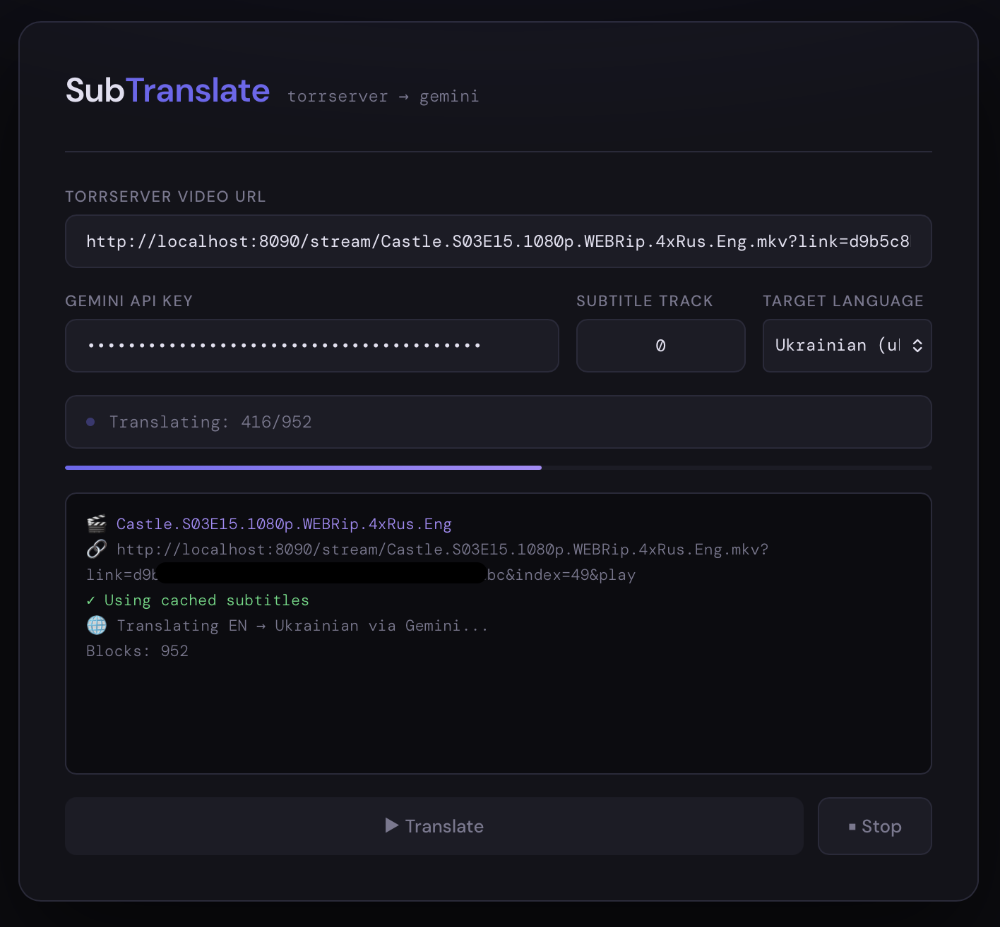

# SubTranslate

Web UI utility to extract and translate subtitles from TorrServer streams using Gemini.

This repository contains a small HTTP server (`translate_subs.py`) that extracts subtitle tracks via `ffmpeg`, sends batches to Gemini for translation, and saves translated .srt files. The app no longer attempts to open video players — it only translates and writes subtitle files.

## Features
- Extract subtitle track from a video stream (via `ffmpeg`).
- Translate subtitles from English to Ukrainian (`uk`) or Russian (`ru`) with Gemini.
- Web UI for entering video URL, Gemini API key, subtitle track and target language.
- Outputs saved to `~/Downloads/translated_subs` by default (or a mounted directory in Docker).

## Files
- `translate_subs.py` — main server script.
- `Dockerfile` — container image with Python + ffmpeg.
- `docker-compose.yml` — convenient compose setup for running the service.

## Quick start — Docker Compose (recommended)
1. Create or export your Gemini API key and optional output dir:

```bash
export GEMINI_API_KEY="your_gemini_api_key"
export OUTPUT_DIR="$HOME/Downloads/translated_subs"
```

2. Build and run:

```bash
docker compose up --build
```

3. Open the UI at: http://localhost:7755

Notes:
- The compose file maps `${OUTPUT_DIR}` on the host to `/root/Downloads/translated_subs` inside the container so translated files are persisted.
- The service reads/writes `/root/.subtranslate.json` for saved settings; you can bind-mount your host `~/.subtranslate.json` if you want persistence across containers.

## Quick start — Docker (single container)
Build image:

```bash
docker build -t subtranslate:latest .
```

Run (map output dir and set API key):

```bash
docker run --rm -p 7755:7755 \
  -e GEMINI_API_KEY="your_key_here" \
  -v "$HOME/Downloads/translated_subs:/root/Downloads/translated_subs" \
  subtranslate:latest
```

## Run locally (no Docker)
Requirements: Python 3.11+, `ffmpeg` on PATH.

```bash
python3 translate_subs.py
```

If you prefer not to set `GEMINI_API_KEY` as an env var, enter it in the web UI and save.

## UI Fields
- TorrServer video URL — URL of the stream to extract subtitles from.
- Gemini API Key — your API key for the Generative Language API.
- Subtitle track — integer track index (default `0`).
- Target language — choose `Ukrainian (uk)`or `Russian (ru)`.

Example TorrServer URL:

```
http://localhost:8090/stream/Castle.S03E15.1080p.WEBRip.4xRus.Eng.mkv?link=d9btestlinksometnigid&index=49&preload
```

## Screenshot

The web UI looks like this (place your screenshot at `assets/screenshot.png`):




## Output
Files are written as `<basename>.<lang>.srt`, e.g. `movie.ru.srt` or `movie.uk.srt` in the output directory.

## Advanced
- The server exposes `/state` (JSON) with status, progress and log lines and `/files` to list output files for diagnostics.
- If running in Docker, the server binds to `0.0.0.0:7755` and you access it from the host at `http://localhost:7755`.

## Troubleshooting
- If subtitles extraction fails, ensure `ffmpeg` can access the stream and the correct subtitle track is selected.
- For Gemini rate limits, the script does basic retry/backoff and will log rate-limit warnings in the UI.

## Security
- Keep your `GEMINI_API_KEY` secret. Prefer passing it via environment variables or a host-mounted `~/.subtranslate.json` instead of embedding in images.

## License
Use as you wish. No license file provided.
